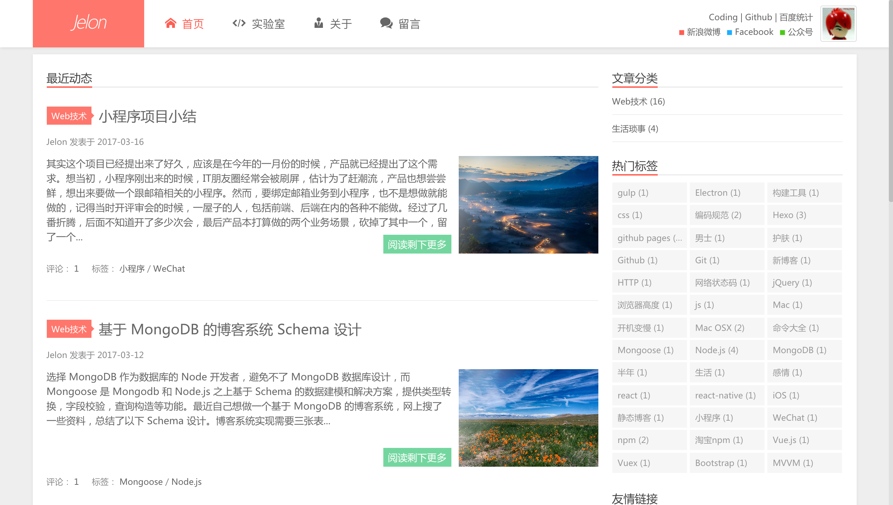

# Xups 主题安装及 Hexo 使用教程


## 主题的一些特性

1. 扁平。思路源于大前端 WordPress 主题。
2. 自带博客评论系统。博客主题自带评论系统，基于 github issues 实现，了解更多请点击[基于 github issues实现的评论框](http://jelon.top/posts/xups-comment-box/)。

## 使用指引

1. 安装hexo

    ```
    npm i hexo-cli -g
    hexo init blog
    cd blog
    npm install
    ```

2. 将主题拉到本地，并解压

    ```
    cd themes
    git clone https://github.com/jangdelong/hexo-theme-xups.git
    ```

3. 配置 _config.yml 的 theme 配置

    ```
    theme: hexo-theme-xups
    ```

4. 运行 `hexo s --watch`

    ```
    cd ..
    hexo generate # 或者 hexo g
    hexo s --watch
    ```

    运行上述命令后，浏览器打开 [http://localhost:4000](http://localhost:4000) 即可本地访问我们的网站

## 创建文章

有两种方法创建文章，可任选其一：

> 注意：文件名不要出现中文!!!

1. 使用`hexo new` 命令

    ``` bash
    $ hexo new "My New Post"
    ```

2. 拷贝现有的文章进行修改

    hexo使用markdown来编辑文章，在source目录下，拷贝任意md文件进行创建新的文章。具体可参考下hexo的官方说明

## 文章规范

1. 使用markdown写博文
2. 建议图片进行单独 cdn 存储
3. 标准配图
   - xups主题现默认有0-9共10张博客配图
   - 博客封面配图：200x140，命名：xxx_thumbnail
4. 指明文章的标题、作者信息、封面图片地址、博客摘要

    ```
    ---
    title: {{ title }}
    date: {{ date }}
    author:
    tags:
    categories:
        - Web技术
        - 生活琐事
    thumbnail:
    blogexcerpt:

    ---

    ```
    > 另外， 如果您需保留原主题的关于页（about）、留言页面（comment）、实验室页（lab）的话， 请将 __source/ 目录下的 about/、comment/、lab/ 三个目录及里面的页面放到您的 Hexo 程序的 source 目录下（注意不是theme主题下的目录）；将 __scaffolds 目录下的 draft.md、page.md、post.md 放到 Hexo 程序的 scaffolds 目录（注意不是theme主题下的目录）。


5. 利用`<!-- more --> `或者`post.blogexcerpt`设置文章的摘要

    示例：

    ```

    ---
    title: 文章标题
    blogexcerpt: 这里是自定义文章摘要
    ...
    ---

    这里是文章正文内容
    ...

    ```

    这部分是文章摘要，这部分是文章摘要。在hexo模版里可通过 `<%- post.blogexcerpt || post.excerpt || post.content %>` 来引用。
    - post.blogexcerpt：自定义摘要
    - post.excerpt：通过`<!-- more  -->`分隔符来获取的文章摘要
    - post.content：如不设置摘要情况，则直接输出文章全部内容

## 评论系统

1. 创建 Github Application
2. 创建仓库
3. 主题 _config.yml 配置

    ```python
    #----------------------------
    # 是否开启评论
    #----------------------------
    comment:
      enable: false      # 是否开启配置
      owner: jangdelong  # 你的 github 账户名
      repo: blog_comments # github repository
      client_id: xxxxxxxxxx # github application client id
      client_secret: xxxxxxxxxxxxxxxxxxxxxxxxxxxxxxxxx # github application secret
    ```
4. 评论框使用

    ```html
    <div id="comments" class="comment">
    </div>
    <script>
    JELON.Comment({
      container: 'comments', // 评论框容器id或对象，留空是默认为 comments 
      label: '<%- post.slug %>' || '<%- post.path %>',  // 文章标签
      owner: '<%- theme.comment.owner %>', // GitHub application 创建者
      repo: '<%- theme.comment.repo %>', // issue 所在仓库名
      clientId: '<%- theme.comment.client_id %>', // GitHub application client_id
      clientSecret: '<%- theme.comment.client_secret %>' // GitHub application client_secret
    });
    </script>
    ```

## 其他

- [Jelon前端小站](http://jelon.top)
